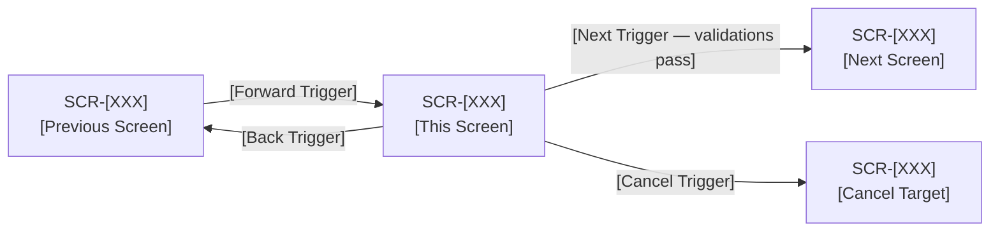
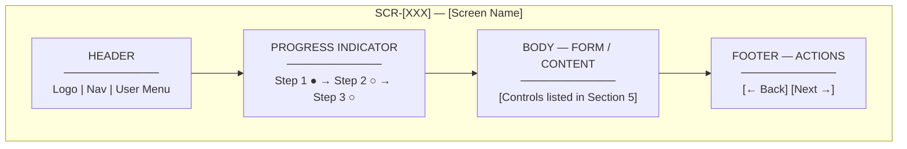
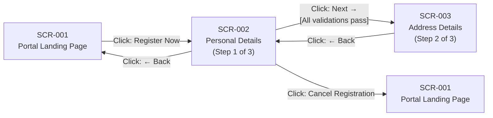

# Screen Wireframe Template

> **Document Flow:** BRD → FRD → Initiative → EPIC → User Story → SubTask
> **Design Flow:** Screen Wireframe → High-Fidelity Mockup (Figma / Design Tool) → UI Development
>
> A Screen Wireframe document captures the structural layout, controls, and navigation
> of a single screen in the application. It is tool-agnostic — the mockup can be
> sketched in ASCII markdown, Mermaid, or Excalidraw notation, and is intended as
> the definitive input artefact for high-fidelity design work in Figma or any other
> design tool.
>
> One screen can be associated with multiple EPICs. One EPIC can reference multiple screens.

---

```
━━━━━━━━━━━━━━━━━━━━━━━━━━━━━━━━━━━━━━━━━━━━━━━━━━━━━━━━━━━━
Screen ID       : SCR-[XXX]
Screen Name     : [Short descriptive name for the screen]
Created Date    : DD-MMM-YYYY
Last Updated    : DD-MMM-YYYY
Author          : [Name / Role]
Status          : [ Draft | Under Review | Approved | In Development | Done ]
Figma Link      : [URL — populated once high-fidelity design is created]
━━━━━━━━━━━━━━━━━━━━━━━━━━━━━━━━━━━━━━━━━━━━━━━━━━━━━━━━━━━━
```

---

## Table of Contents

| # | Section |
| --- | --- |
| 1 | Screen ID |
| 2 | Screen Description |
| 3 | EPIC References |
| 4 | Screen Navigation |
| 5 | Screen Controls |
| — | 5A. Fields |
| — | 5B. Charts |
| — | 5C. Analytics |
| — | 5D. Tables |
| — | 5E. Details / Info Panels |
| — | 5F. Actions / Buttons |
| 6 | Screen Mockup |
| 7 | Design Handoff Notes |
| — | Revision History |

---

## 1. Screen ID

> **Guideline:** A unique identifier for this screen across the entire application.
> Format: `SCR-[XXX]` where XXX is a zero-padded sequential number (e.g., SCR-001, SCR-012).
> Screen IDs are globally unique — two screens cannot share the same ID even if they
> belong to different EPICs or flows.

```
Screen ID   : SCR-[XXX]
Screen Name : [Short name — used in navigation references and RTM]

Example:
  Screen ID   : SCR-002
  Screen Name : Personal Details — Registration Step 1
```

---

## 2. Screen Description

> **Guideline:** Provide a detailed description of this screen. This is the primary reference
> for designers, developers, and testers. The description must cover:
> - The **purpose** of this screen — what it allows the user to do
> - The **context** in which this screen appears — where in the user journey it sits
> - The **user type** who interacts with this screen
> - Any **important business rules** that directly govern this screen's behaviour
> - Any **conditional display logic** — sections that show/hide based on state or user input
> - The **outcome** of successfully completing this screen — what happens next

```
[Detailed multi-paragraph description]

Example:
  Purpose:
    The Personal Details screen is the first step of the three-step customer
    registration form. It collects core identity information from a new customer:
    First Name, Last Name, Date of Birth, Email Address, Mobile Number, and
    Gender (optional).

  Context:
    This screen is displayed immediately after the customer clicks "Register Now"
    on the Landing Page (SCR-001). It is Step 1 of 3 in the registration wizard.
    A progress indicator at the top shows the customer their position in the flow.

  User Type:
    New (unauthenticated) customer visiting the portal for the first time.

  Business Rules Governing This Screen:
    - BR-01: All fields except Gender are mandatory.
    - BR-02: Customer must be at least 18 years old (validated via Date of Birth).
    - BR-03: Email format must match standard email regex.
    - BR-04: Gender is optional and must not block progression.

  Conditional Display Logic:
    - Inline error messages appear beneath each field on blur and on "Next" click.
    - Error messages clear as soon as the customer starts re-typing in the field.
    - "Next" button remains visible at all times but triggers validation on click.

  Outcome:
    On successful validation, the customer is navigated to Step 2 — Address Details
    (SCR-003). Form state is preserved in session so the customer can navigate back
    without losing data.
```

---

## 3. EPIC References

> **Guideline:** List all EPICs this screen is part of. One screen can serve multiple EPICs.
> For example, a shared Profile screen may be used in both the Registration EPIC and the
> Account Management EPIC. List each EPIC separately. Also list the User Stories within
> each EPIC that directly reference this screen.

| Sr No | EPIC ID | EPIC Description | Related User Story IDs |
| --- | --- | --- | --- |
| 1 | EPIC-[XXX] | [One-line description of the EPIC] | US-[XXX], US-[XXX] |
| 2 | EPIC-[XXX] | [One-line description of the EPIC] | US-[XXX] |

---

## 4. Screen Navigation

> **Guideline:** Document the navigation context for this screen — where the user
> comes from and where they go next. A screen can have multiple entry points
> (e.g., reached from Login or from Dashboard) and multiple exit points
> (e.g., Next goes to SCR-003, Back goes to SCR-001, Cancel goes to SCR-001).
> Mark exit conditions clearly.

### 4A. Navigation Map

| Direction | Screen ID | Screen Name | Trigger / Condition |
| --- | --- | --- | --- |
| Previous (Back) | SCR-[XXX] | [Screen Name] | [What triggers navigation back — e.g., "Back button click"] |
| Next (Forward) | SCR-[XXX] | [Screen Name] | [What triggers navigation forward — e.g., "Next button, all validations pass"] |
| Cancel / Exit | SCR-[XXX] | [Screen Name] | [What triggers cancellation — e.g., "Cancel button, unsaved data discarded"] |
| Error Redirect | SCR-[XXX] | [Screen Name] | [Conditional — e.g., "Session timeout redirects to Login SCR-001"] |

### 4B. Navigation Flow Diagram

> Use a Mermaid flowchart to visualise the screen's position in the overall flow.
> Replace the placeholder screens with actual IDs and names.



---

## 5. Screen Controls

> **Guideline:** List every interactive and display element on this screen.
> Organise controls into the sub-sections below. Only include the sub-sections
> that are relevant to this screen — mark unused sub-sections as N/A.

---

### 5A. Fields

> Input fields, dropdowns, radio buttons, checkboxes, date pickers, file uploads, and
> any other control that accepts user input.

| Field ID | UI Label | Field Type | Mandatory | Default Value | Placeholder Text | Validation Rules | Notes |
| --- | --- | --- | --- | --- | --- | --- | --- |
| FLD-001 | [Label as shown on screen] | [ Text \| Number \| Email \| Password \| Date \| Dropdown \| Radio \| Checkbox \| File \| Textarea ] | [ Y \| N ] | [Default or blank] | [Hint text inside field] | [Rules e.g. max 100 chars, regex] | [Any special behaviour] |

> **Field Type Reference:**
> - `Text` — Single-line text input
> - `Number` — Numeric input only
> - `Email` — Email format input
> - `Password` — Masked input
> - `Date` — Date picker (specify display format e.g. DD/MM/YYYY)
> - `Dropdown` — Single-select from a list
> - `Multi-Select` — Multiple selection from a list
> - `Radio` — Single-select option group
> - `Checkbox` — Boolean toggle or multi-select
> - `File` — File upload control
> - `Textarea` — Multi-line text input
> - `Toggle` — On/Off switch

---

### 5B. Charts

> Visual data representations such as bar charts, line charts, pie charts, donut charts,
> scatter plots, or heatmaps embedded in the screen.

| Chart ID | Chart Title | Chart Type | X-Axis / Category | Y-Axis / Value | Data Source | Filters Available | Notes |
| --- | --- | --- | --- | --- | --- | --- | --- |
| CHT-001 | [Title as shown] | [ Bar \| Line \| Pie \| Donut \| Scatter \| Area \| Heatmap \| Gauge ] | [Axis label or N/A] | [Axis label or N/A] | [API endpoint or dataset name] | [Filter controls if any] | [Drill-down, tooltips, etc.] |

> Mark this section `N/A` if the screen contains no charts.

---

### 5C. Analytics

> KPI tiles, metric cards, summary counters, or scorecards displayed on the screen —
> typically read-only data highlights (e.g., "Total Applications: 1,240").

| Metric ID | Metric Label | Metric Type | Value Format | Data Source | Refresh Frequency | Notes |
| --- | --- | --- | --- | --- | --- | --- |
| MTR-001 | [Label as shown] | [ Count \| Percentage \| Currency \| Duration \| Score \| Rate ] | [e.g., "#,##0" or "0.0%"] | [API endpoint or dataset] | [Real-time \| On load \| Scheduled] | [Comparison period, trend indicator, etc.] |

> Mark this section `N/A` if the screen contains no analytics metrics.

---

### 5D. Tables

> Data grids and tabular listings where records are displayed in rows and columns,
> typically with pagination, sorting, or filtering.

| Table ID | Table Title | Purpose | Columns | Pagination | Sortable Columns | Filterable Columns | Row Actions | Notes |
| --- | --- | --- | --- | --- | --- | --- | --- | --- |
| TBL-001 | [Title as shown] | [What data it lists] | [Column 1, Column 2, …] | [ Y — [N] per page \| N ] | [Column names or "All" or "None"] | [Column names or "None"] | [View, Edit, Delete, etc.] | [Empty state message, etc.] |

> Mark this section `N/A` if the screen contains no tables.

---

### 5E. Details / Info Panels

> Read-only display sections that show contextual or summary information —
> e.g., a customer profile panel, a selected record's details sidebar, a status card,
> or a confirmation summary before submission.

| Panel ID | Panel Title | Purpose | Fields Displayed | Triggered By | Notes |
| --- | --- | --- | --- | --- | --- |
| PNL-001 | [Title as shown] | [What context this panel provides] | [Field 1, Field 2, …] | [Always visible \| On row select \| On button click] | [Expandable, collapsible, modal, sidebar, etc.] |

> Mark this section `N/A` if the screen contains no detail or info panels.

---

### 5F. Actions / Buttons

> All clickable action controls on the screen — primary buttons, secondary buttons,
> icon buttons, links, and any other control that triggers a navigation or system action.

| Action ID | Label | Button Type | Position on Screen | Action Triggered | Target Screen | Enabled Condition | Notes |
| --- | --- | --- | --- | --- | --- | --- | --- |
| ACT-001 | [Label as shown] | [ Primary \| Secondary \| Danger \| Link \| Icon ] | [e.g., Bottom-right, Top toolbar] | [Navigate \| Submit \| Open Modal \| Download \| Reset] | [SCR-XXX or N/A] | [Always \| Only when form is valid \| Only when row selected] | [Confirmation dialog, etc.] |

---

## 6. Screen Mockup

> **Guideline:** Provide a structural sketch of the screen layout. The mockup must show:
> - The overall page structure (header, body, footer)
> - Relative positions of all controls listed in Section 5
> - Navigation elements (Back, Next, Cancel buttons)
> - Labels and placeholder text for key fields
>
> **Format Options (choose one or combine):**
>
> **Option A — ASCII / Markdown Sketch (recommended for quick wireframes)**
> Use box-drawing characters (`┌ ─ ┐ │ └ ┘ ├ ┤ ┬ ┴ ┼`) and standard characters
> to sketch the screen layout within a code block.
>
> **Option B — Mermaid Block Diagram**
> Use `graph TD` or `block-beta` in a mermaid block to represent layout sections
> as nodes arranged top-to-bottom.
>
> **Option C — Excalidraw JSON Reference**
> Paste the Excalidraw JSON payload in a code block tagged `excalidraw`.
> Tools like the VS Code Excalidraw extension or excalidraw.com can render it.
>
> All three options are valid inputs for a Figma designer to create a high-fidelity mockup.
> The ASCII sketch is preferred for version-controlled documents as it renders in any
> Markdown viewer without plugins.

---

### 6A. ASCII Wireframe Sketch

```
[Replace the placeholder below with the actual screen sketch]

Example sketch structure:

┌─────────────────────────────────────────────────────────────────┐
│  [LOGO]                                    [Help]  [Login]      │
├─────────────────────────────────────────────────────────────────┤
│  ● Step 1: [Section Title]   ○ Step 2: ──────   ○ Step 3: ───  │
├─────────────────────────────────────────────────────────────────┤
│                                                                 │
│  [Section Heading]                                              │
│                                                                 │
│  [Label A] *                    [Label B] *                     │
│  ┌─────────────────────────┐    ┌─────────────────────────┐    │
│  │ [Placeholder text     ] │    │ [Placeholder text     ] │    │
│  └─────────────────────────┘    └─────────────────────────┘    │
│                                                                 │
│  [Label C] *                    [Label D]                       │
│  ┌─────────────────────────┐    (○) Option 1                   │
│  │ [DD/MM/YYYY           ] │    (○) Option 2                   │
│  └─────────────────────────┘    (○) Option 3                   │
│                                                                 │
│  [Label E] *                                                    │
│  ┌─────────────────────────────────────────────────────────┐   │
│  │ [Placeholder text                                     ] │   │
│  └─────────────────────────────────────────────────────────┘   │
│                                                                 │
├─────────────────────────────────────────────────────────────────┤
│  [← Back]                                      [Next →]        │
└─────────────────────────────────────────────────────────────────┘

Legend:
  *     = Mandatory field
  (○)   = Radio button (unselected)
  (●)   = Radio button (selected)
  [ ]   = Checkbox (unchecked)
  [x]   = Checkbox (checked)
  [▼]   = Dropdown
  [↑↓]  = Sortable column
```

---

### 6B. Mermaid Layout Diagram (Optional)

> Use this alongside the ASCII sketch to show navigation flow context,
> or as the primary mockup if the screen is a dashboard with multiple panels.



---

### 6C. Excalidraw Reference (Optional)

> Paste the Excalidraw JSON export here if a richer visual sketch has been created.
> Renderable in VS Code with the Excalidraw extension or at excalidraw.com.

```excalidraw
{
  "type": "excalidraw",
  "version": 2,
  "elements": [],
  "appState": { "viewBackgroundColor": "#ffffff" },
  "_comment": "Paste full Excalidraw JSON export here"
}
```

---

## 7. Design Handoff Notes

> **Guideline:** Capture any additional guidance for the designer creating the
> high-fidelity mockup in Figma or other tools. Include typography, spacing,
> colour palette references, component library notes, accessibility requirements,
> and responsive breakpoint behaviour.

### 7A. Visual Design Notes

```
Typography     : [e.g., Follow Design System v2 — Heading H2 for section title, Body-1 for labels]
Colour Palette : [e.g., Primary CTA button: Brand Blue #1565C0 / Error state: #D32F2F]
Spacing        : [e.g., 24px padding on all sides, 16px gap between fields]
Border Radius  : [e.g., Input fields: 4px, Buttons: 8px]
Component Lib  : [e.g., Use Material UI v5 components — TextField, Button, Radio Group]
```

### 7B. Responsive Breakpoints

| Breakpoint | Width | Layout Changes |
| --- | --- | --- |
| Desktop | ≥ 1280px | [e.g., Two-column field layout] |
| Tablet | 768px – 1279px | [e.g., Single-column field layout] |
| Mobile | < 768px | [e.g., Full-width fields, sticky footer actions] |

### 7C. Accessibility Requirements

```
- [ ] All fields must have associated <label> elements (not placeholder-only)
- [ ] Error messages must be linked to their field using aria-describedby
- [ ] Tab order must follow left-to-right, top-to-bottom reading order
- [ ] Minimum touch target size: 44×44px for all interactive controls
- [ ] Colour contrast: minimum 4.5:1 for normal text (WCAG 2.1 AA)
- [ ] [Add any screen-specific accessibility requirements here]
```

### 7D. Figma Handoff Checklist

```
- [ ] Figma file link populated in Header Block
- [ ] All controls in Section 5 are represented in the Figma frame
- [ ] Interactive prototype links wired to next/previous screens
- [ ] Error states designed for all mandatory fields
- [ ] Empty states designed for any tables or lists
- [ ] Design reviewed by Product Owner
- [ ] Design approved before development begins
```

---

## Revision History

```
| Version | Date         | Author         | Changes Made                              |
|---------|--------------|----------------|-------------------------------------------|
| 1.0     | DD-MMM-YYYY  | [Author Name]  | Initial wireframe draft                   |
| 1.1     | DD-MMM-YYYY  | [Author Name]  | [Brief description of changes]            |
```

---

*Template Version: 1.0 | Last Reviewed: 25-Mar-2026*

---
---

# EXAMPLE — SCR-002: Personal Details (Registration Step 1)

> **Context:** This example is drawn from **EPIC-001: Customer Registration & KYC Verification**
> within **Initiative INIT-001: Unified Digital Onboarding Platform**.
> SCR-002 is the first data-entry screen in the three-step registration wizard.

---

```
━━━━━━━━━━━━━━━━━━━━━━━━━━━━━━━━━━━━━━━━━━━━━━━━━━━━━━━━━━━━
Screen ID       : SCR-002
Screen Name     : Personal Details — Registration Step 1
Created Date    : 25-Mar-2026
Last Updated    : 25-Mar-2026
Author          : UX Designer / Business Analyst
Status          : Approved
Figma Link      : [To be populated after high-fidelity design]
━━━━━━━━━━━━━━━━━━━━━━━━━━━━━━━━━━━━━━━━━━━━━━━━━━━━━━━━━━━━
```

---

## 1. Screen ID

```
Screen ID   : SCR-002
Screen Name : Personal Details — Registration Step 1
```

---

## 2. Screen Description

```
Purpose:
  SCR-002 is the first data-entry step of the three-step customer registration
  wizard. It is the entry point for a new customer to provide their core personal
  identity information: First Name, Last Name, Date of Birth, Email Address,
  Mobile Number, and optionally Gender. The data collected on this screen forms
  the customer's primary identity record (customer_draft table) and is subsequently
  used for KYC verification in EPIC-001.

Context:
  This screen is presented immediately after the customer clicks "Register Now"
  on the Portal Landing Page (SCR-001). At the top of the screen a step-progress
  indicator shows: Step 1 (Personal Details — active) → Step 2 (Address Details)
  → Step 3 (Document Upload). The customer cannot skip steps — they must complete
  Step 1 before proceeding to Step 2 (SCR-003).

  The screen is part of an unauthenticated public flow. No login is required to
  reach this screen. Session state is maintained in browser session storage so
  that if the customer navigates back to Step 1 from Step 2, their previously
  entered data is pre-populated.

User Type:
  New (unauthenticated) customer visiting the portal for the first time.

Business Rules Governing This Screen:
  - BR-01: First Name, Last Name, Date of Birth, Email Address, and Mobile Number
           are mandatory. The form must not advance if any of these are empty.
  - BR-02: Customer must be at least 18 years of age as of today's date.
           Calculated from the entered Date of Birth. Exact day counted.
  - BR-03: Email Address must match the format: local@domain.tld.
           Format validated client-side only. Uniqueness validated server-side
           (US-003 backend) after the full form is submitted on Step 3.
  - BR-04: Gender is optional. The absence of a Gender selection must not
           prevent the customer from clicking "Next".
  - BR-05: Mobile Number must be exactly 10 digits. Non-numeric characters
           entered by the user (spaces, hyphens) are stripped before validation.

Conditional Display Logic:
  - All inline error messages are hidden by default.
  - On blur of any mandatory field: the field's validation function is called.
    If invalid — the error message appears inline below the field in red.
    The field border changes to error colour (#D32F2F).
  - As soon as the customer starts re-typing in an errored field — the error
    message is cleared immediately (does not wait for blur or Next click).
  - On "Next" click: all five mandatory fields are validated simultaneously.
    All errors surface in a single click. The form does not advance until all
    pass. Gender (optional) is excluded from this validation run.

Outcome:
  On successful validation of all mandatory fields, the customer is navigated
  to SCR-003 (Address Details — Step 2). The data entered on SCR-002 is saved
  to browser session storage to enable back-navigation without data loss.
```

---

## 3. EPIC References

| Sr No | EPIC ID | EPIC Description | Related User Story IDs |
| --- | --- | --- | --- |
| 1 | EPIC-001 | End-to-end digital onboarding covering customer registration, document upload, OCR extraction, and KYC verification | US-001, US-002, US-003 |

> **Note:** SCR-002 is currently associated with EPIC-001 only. If an Account Management
> EPIC is added in a future initiative that allows customers to update their personal
> details post-registration, SCR-002 or a variant screen would be added to that EPIC as well.

---

## 4. Screen Navigation

### 4A. Navigation Map

| Direction | Screen ID | Screen Name | Trigger / Condition |
| --- | --- | --- | --- |
| Previous (Back) | SCR-001 | Portal Landing Page | Customer clicks "← Back" button or browser Back |
| Next (Forward) | SCR-003 | Address Details — Registration Step 2 | Customer clicks "Next →" AND all mandatory field validations pass |
| Cancel / Exit | SCR-001 | Portal Landing Page | Customer clicks "Cancel Registration" link — unsaved data discarded, session cleared |
| Session Timeout | SCR-001 | Portal Landing Page | Browser session expires after 30 minutes of inactivity — session storage cleared |

### 4B. Navigation Flow Diagram



---

## 5. Screen Controls

### 5A. Fields

| Field ID | UI Label | Field Type | Mandatory | Default Value | Placeholder Text | Validation Rules | Notes |
| --- | --- | --- | --- | --- | --- | --- | --- |
| FLD-001 | First Name | Text | Y | blank | e.g. Priya | Required. Letters and spaces only. Max 100 characters. Regex: `/^[a-zA-Z\s]{1,100}$/` | Trim leading/trailing spaces before validation |
| FLD-002 | Last Name | Text | Y | blank | e.g. Sharma | Required. Letters and spaces only. Max 100 characters. Same regex as First Name | Trim leading/trailing spaces before validation |
| FLD-003 | Date of Birth | Date | Y | blank | DD/MM/YYYY | Required. Must be a valid calendar date. Customer age derived must be ≥ 18 years as of today | Display format DD/MM/YYYY; store internally as ISO YYYY-MM-DD |
| FLD-004 | Email Address | Email | Y | blank | e.g. priya.sharma@email.com | Required. Format: `/^[^\s@]+@[^\s@]+\.[^\s@]+$/`. Uniqueness checked server-side only | Do not call API from client-side validator — format check only |
| FLD-005 | Mobile Number | Text | Y | blank | e.g. 9876543210 | Required. Exactly 10 digits after stripping non-numeric characters. Regex: `/^\d{10}$/` | Strip spaces and hyphens before applying regex; uniqueness server-side only |
| FLD-006 | Gender | Radio | N | None selected | — | No mandatory validation — optional field per BR-04 | Options: Male / Female / Other / Prefer not to say |

---

### 5B. Charts

> `N/A — SCR-002 is a data-entry form and contains no charts.`

---

### 5C. Analytics

> `N/A — SCR-002 is a data-entry form and contains no analytics metrics.`

---

### 5D. Tables

> `N/A — SCR-002 is a data-entry form and contains no data tables.`

---

### 5E. Details / Info Panels

| Panel ID | Panel Title | Purpose | Fields Displayed | Triggered By | Notes |
| --- | --- | --- | --- | --- | --- |
| PNL-001 | Registration Progress | Shows the customer their position in the three-step wizard and completed steps | Step 1: Personal Details (active), Step 2: Address Details, Step 3: Document Upload | Always visible at top of screen | Step indicators update as customer progresses; completed steps shown with a checkmark ✓ |

---

### 5F. Actions / Buttons

| Action ID | Label | Button Type | Position on Screen | Action Triggered | Target Screen | Enabled Condition | Notes |
| --- | --- | --- | --- | --- | --- | --- | --- |
| ACT-001 | Next → | Primary | Bottom-right, fixed footer | Runs client-side validation on all 5 mandatory fields. If all pass, saves state to session and navigates forward | SCR-003 | Always visible; activates on click — disabled state not used (validation runs on click, errors shown inline) | Label changes to "Submitting…" with a spinner if backend call is triggered |
| ACT-002 | ← Back | Secondary | Bottom-left, fixed footer | Navigates to previous screen without clearing session state | SCR-001 | Always enabled | On SCR-001 the "Register Now" button will re-populate SCR-002 from session if session is still alive |
| ACT-003 | Cancel Registration | Link | Top-right, below header | Clears session storage and redirects to landing page | SCR-001 | Always visible | A confirmation dialog appears: "Are you sure? Your progress will be lost." — OK / Cancel |

---

## 6. Screen Mockup

### 6A. ASCII Wireframe Sketch

```
┌─────────────────────────────────────────────────────────────────────┐
│  [🏦 OnboardingPortal]                   [Help (?)]  [Sign In]      │
├─────────────────────────────────────────────────────────────────────┤
│                                                                     │
│   ●─── Step 1: Personal Details ──── ○── Step 2: Address ──        │
│                                           ○── Step 3: Documents ── │
│                                                                     │
├─────────────────────────────────────────────────────────────────────┤
│                                                                     │
│   Personal Details                                                  │
│   ─────────────────────────────────────────────────────────────    │
│                                                                     │
│   First Name *                    Last Name *                       │
│   ┌──────────────────────────┐    ┌──────────────────────────┐     │
│   │ e.g. Priya               │    │ e.g. Sharma              │     │
│   └──────────────────────────┘    └──────────────────────────┘     │
│                                                                     │
│   Date of Birth *                 Gender                           │
│   ┌──────────────────────────┐    (○) Male                         │
│   │ DD / MM / YYYY       [📅]│    (○) Female                       │
│   └──────────────────────────┘    (○) Other                        │
│                                   (○) Prefer not to say            │
│                                                                     │
│   Email Address *                                                   │
│   ┌──────────────────────────────────────────────────────────┐     │
│   │ e.g. priya.sharma@email.com                              │     │
│   └──────────────────────────────────────────────────────────┘     │
│                                                                     │
│   Mobile Number *                                                   │
│   ┌──────────────────────────────────────────────────────────┐     │
│   │ e.g. 9876543210                                          │     │
│   └──────────────────────────────────────────────────────────┘     │
│                                                                     │
│   ─────────────────────────────────────────────────────────────    │
│   * Mandatory fields                                                │
│                                                                     │
├─────────────────────────────────────────────────────────────────────┤
│  [← Back]         [Cancel Registration]           [   Next →   ]   │
└─────────────────────────────────────────────────────────────────────┘


── Error State (shown inline when field fails validation) ──

   First Name *
   ┌──────────────────────────┐  ← Red border (#D32F2F)
   │ Pr1ya!                   │
   └──────────────────────────┘
   ⚠ First Name must contain letters only, max 100 characters

   Date of Birth *
   ┌──────────────────────────┐  ← Red border
   │ 15 / 03 / 2015       [📅]│
   └──────────────────────────┘
   ⚠ You must be at least 18 years old to register


Legend:
  *      = Mandatory field
  (○)    = Radio button — unselected
  (●)    = Radio button — selected
  [📅]   = Calendar/date picker icon
  ⚠      = Inline error message (red, #D32F2F)
  ───    = Section separator
  ●───   = Active step in progress indicator
  ○───   = Inactive/upcoming step in progress indicator
```

---

### 6B. Mermaid Layout Diagram

```mermaid
graph TD
    subgraph SCR002["SCR-002 — Personal Details (Registration Step 1)"]
        HDR["HEADER\n─────────────────────────────────\nLogo | Help | Sign In"]
        PROG["PROGRESS INDICATOR\n─────────────────────────────────\n● Step 1: Personal Details  ○ Step 2: Address  ○ Step 3: Documents"]
        SECT["FORM SECTION TITLE\n─────────────────────────────────\nPersonal Details"]
        ROW1["FIELD ROW 1\n─────────────────────────────────\n[FLD-001] First Name *  |  [FLD-002] Last Name *"]
        ROW2["FIELD ROW 2\n─────────────────────────────────\n[FLD-003] Date of Birth *  |  [FLD-006] Gender (optional radio group)"]
        ROW3["FIELD ROW 3 — FULL WIDTH\n─────────────────────────────────\n[FLD-004] Email Address *"]
        ROW4["FIELD ROW 4 — FULL WIDTH\n─────────────────────────────────\n[FLD-005] Mobile Number *"]
        FTR["FOOTER ACTIONS\n─────────────────────────────────\n[ACT-002] ← Back  |  [ACT-003] Cancel  |  [ACT-001] Next →"]
    end

    HDR --> PROG
    PROG --> SECT
    SECT --> ROW1
    ROW1 --> ROW2
    ROW2 --> ROW3
    ROW3 --> ROW4
    ROW4 --> FTR
```



---

## 7. Design Handoff Notes

### 7A. Visual Design Notes

```
Typography     : Section title "Personal Details" — Heading H2, Bold, #212121
                 Field labels — Body-2, Medium weight, #424242
                 Placeholder text — Body-2, Regular, #9E9E9E
                 Error messages — Caption, Regular, #D32F2F
                 Button labels — Button text style, uppercase, letter-spacing 0.5px

Colour Palette : Primary button background: Brand Blue #1565C0
                 Primary button hover: #0D47A1
                 Secondary button: outlined, border #1565C0, text #1565C0
                 Input border (default): #BDBDBD
                 Input border (focus): #1565C0, 2px
                 Input border (error): #D32F2F, 2px
                 Error message text: #D32F2F
                 Progress step (active): #1565C0 filled circle
                 Progress step (inactive): #9E9E9E outline circle
                 Progress step (complete): #2E7D32 with ✓ icon

Spacing        : Page horizontal padding: 24px (mobile), 48px (tablet), 120px (desktop)
                 Field label to input gap: 8px
                 Input to error message gap: 4px
                 Between field rows: 24px
                 Between two side-by-side fields: 16px
                 Footer action bar top border: 1px solid #E0E0E0, padding-top 24px

Border Radius  : Input fields: 4px
                 Primary/Secondary buttons: 8px

Component Lib  : Material UI v5 — TextField (outlined variant), Button, RadioGroup,
                 DatePicker (from @mui/x-date-pickers), LinearStepper
```

### 7B. Responsive Breakpoints

| Breakpoint | Width | Layout Changes |
| --- | --- | --- |
| Desktop | ≥ 1280px | Two-column layout: First Name + Last Name side by side; DOB + Gender side by side |
| Tablet | 768px – 1279px | Two-column layout maintained; page padding reduced to 48px |
| Mobile | < 768px | All fields stack single-column full-width; footer action buttons stack vertically with Next on top; Back and Cancel side by side below |

### 7C. Accessibility Requirements

```
- [x] FLD-001 through FLD-006 must each have an associated <label> with htmlFor
      matching the input's id — do not rely on placeholder text as the label
- [x] Error messages must use aria-describedby to link the <span> error element
      to its input field (e.g., id="fld-001-error" on the span, aria-describedby="fld-001-error" on the input)
- [x] aria-invalid="true" must be set on each input when it is in error state
- [x] aria-required="true" must be set on all five mandatory fields (FLD-001 to FLD-005)
- [x] Tab order: FLD-001 → FLD-002 → FLD-003 → FLD-006 (radio group) → FLD-004 → FLD-005 → ACT-002 (Back) → ACT-003 (Cancel) → ACT-001 (Next)
- [x] Minimum touch target: 44×44px for all buttons, radio buttons, and the date picker icon
- [x] Colour contrast: all text on white background must meet WCAG 2.1 AA (4.5:1 minimum)
      — Error message red #D32F2F on white = 5.1:1 ✓
      — Label grey #424242 on white = 9.7:1 ✓
- [x] Date picker must be keyboard-navigable — calendar must be dismissible via Escape key
- [x] Progress indicator must convey step status to screen readers using
      aria-current="step" on the active step and aria-label="Completed" on finished steps
```

### 7D. Figma Handoff Checklist

```
- [ ] Figma file link populated in Header Block (top of this document)
- [ ] All 6 fields (FLD-001 to FLD-006) represented with default, focus, and error states
- [ ] Progress indicator component created with all three states: inactive / active / complete
- [ ] All three button states designed: default / hover / disabled / loading (spinner on Next)
- [ ] Error state mockup created showing multiple simultaneous inline errors
- [ ] Mobile layout frame created (375px width) with single-column stacked fields
- [ ] Cancel confirmation dialog/modal designed
- [ ] Design reviewed by Product Owner
- [ ] Design approved and version-tagged in Figma before development handoff
```

---

## Revision History

```
| Version | Date         | Author              | Changes Made                              |
|---------|--------------|---------------------|-------------------------------------------|
| 1.0     | 25-Mar-2026  | Business Analyst    | Initial wireframe — Personal Details form |
```

---

*Template Version: 1.0 | Last Reviewed: 25-Mar-2026*
